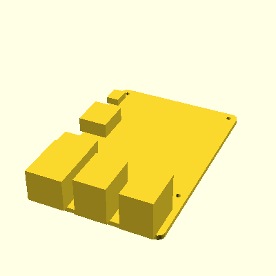

This repository contains [Landau](https://github.com/landaujs/landau) CAD models for Raspberry Pi Boards. This may be usefull to e.g. design cases that fit the specific boards.

## Installation in your project

To use the landau models in you project you can install the package via:

```
npm install hobofan/landau-rpi
```

## STLs

The STLs can be built by:

- Cloning the repository
- `npm install`
- `npm run build-model`

You can find the resulting STLs in the `output` directory.

## Coverage

The project currently only contains a simple model for the Raspberry Pi 3B:



## Usage

```jsx
import { RaspberryPi3B, rpi3bDimensions } from '@hobofan/landau-rpi';

const SomeLandauModel = () => (
  <union>
    <RaspberryPi3B/>
    <cuboid size={[rpi3bDimensions.boardWidth, 1, 1]} />
  </union>
);

```

## License

Licensed under the MIT license (See [LICENSE](LICENSE) or http://opensource.org/licenses/MIT).

